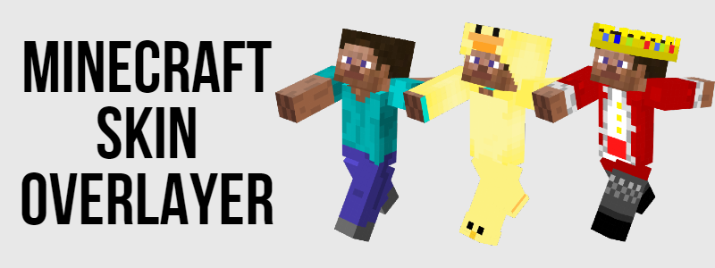

# 

# How to use

You will need to have node.js installed on your system in order to run the code. Download the repo to a folder somewhere, and upload your skin as a .png file into the folder. Specify the name of the file in `index.js` and choose a template as well. Run `npm i` to install all the modules neccesary and then `npm start` to run the script, and it should output the finalised skin to `output.png`

# How to make templates

All this script does is overlay one image onto another. Templates are just skin files that are overlayed on the base image that the user specifies, so you can make a skin that is just a crown, and then the crown would be placed onto the skin. There isn't much code, so you can just read it to get an understanding of how it works.

# Issues

There is no way to make this perfect, and your skin might not look very good with the templates. Overlays may appear under the outer layer due to skins being designed in that way.